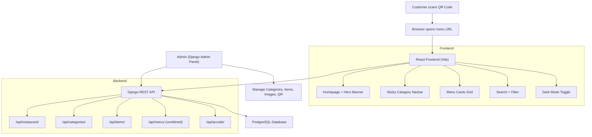

# The Chai Spot — QR Menu Restaurant Web Application

A full-stack digital menu system: customers scan a QR code → a premium, mobile-first website opens → they browse the entire menu with categories, search, filters, and beautiful UI.

## User Review Required

> [!IMPORTANT]
> **Frontend folder typo**: The existing frontend directory is named `frontent` (missing an "d"). I will keep this name as-is to avoid breaking anything, unless you'd like me to rename it to `frontend`.

> [!IMPORTANT]
> **Database choice**: Your requirement specifies PostgreSQL, but for local development I'll configure **SQLite as the default** with a clear PostgreSQL config section ready to swap in. This lets you run locally without installing PostgreSQL first. When you deploy to Render, you'll just set the `DATABASE_URL` environment variable. **Let me know if you want PostgreSQL-only from the start** (you'll need it installed locally).

> [!WARNING]
> **Food images**: Since we can't use copyrighted images, I will generate AI food images for the key menu items using the image generation tool to make the demo look premium and realistic.

## Open Questions

1. **Do you want to rename `frontent/` → `frontend/`?** (Recommended: yes)
2. **Do you want a customer cart/ordering system**, or is this purely a display-only menu (view-only, no ordering)? Plan assumes **view-only**.
3. **Do you have a logo** for The Chai Spot, or should I design one?

---

## Architecture Overview



---

## Proposed Changes

### Backend — Django App: `menu`

#### [NEW] [menu/](file:///d:/PROJECT%20ALL/the%20chai%20spot/backend/menu/) — New Django app

Create a `menu` Django app with these files:

##### `menu/models.py` — Database Models

| Model | Fields | Purpose |
|-------|--------|---------|
| `Restaurant` | name, tagline, description, logo, address, phone, email, opening_hours, is_active | Cafe details |
| `Category` | name, slug, description, icon, image, display_order, is_active | Menu sections (Chai, Coffee, etc.) |
| `MenuItem` | name, slug, description, price, original_price, image, category (FK), is_veg, is_bestseller, is_todays_special, is_popular, is_available, display_order, created_at | Individual items |
| `QRCode` | restaurant (FK), url, qr_image, label, created_at | Generated QR codes |

##### `menu/serializers.py` — DRF Serializers

- `RestaurantSerializer` — full restaurant info
- `CategorySerializer` — category with item count
- `MenuItemSerializer` — full item detail
- `CategoryWithItemsSerializer` — nested: category + its items (for the `/api/menu/` endpoint)
- `QRCodeSerializer` — QR code data

##### `menu/views.py` — API Views

| Endpoint | Method | View | Description |
|----------|--------|------|-------------|
| `/api/restaurant/` | GET | `RestaurantDetailView` | Returns cafe info |
| `/api/categories/` | GET | `CategoryListView` | All active categories |
| `/api/items/` | GET | `MenuItemListView` | All items (filterable by category, search, popular, today's special) |
| `/api/items/<slug>/` | GET | `MenuItemDetailView` | Single item detail |
| `/api/menu/` | GET | `FullMenuView` | Combined: all categories with their items nested |
| `/api/qrcode/` | GET | `QRCodeView` | Get/generate QR code |

##### `menu/admin.py` — Rich Admin Panel

- `RestaurantAdmin` — fieldsets for branding
- `CategoryAdmin` — drag-and-drop ordering, image preview
- `MenuItemAdmin` — list display with image thumbnails, filters (veg/non-veg, bestseller, category), search, inline editing
- `QRCodeAdmin` — QR preview and generation action

##### `menu/management/commands/seed_data.py` — Seed Command

A `python manage.py seed_data` command that populates:
- 1 Restaurant (The Chai Spot)
- 11 Categories
- 60+ Menu Items with realistic names, descriptions, and prices
- 1 QR Code

---

#### [MODIFY] [settings.py](file:///d:/PROJECT%20ALL/the%20chai%20spot/backend/backend/settings.py)

Changes:
- Add `rest_framework`, `corsheaders`, `menu` to `INSTALLED_APPS`
- Add `CorsMiddleware` to `MIDDLEWARE`
- Configure `CORS_ALLOWED_ORIGINS` for React dev server
- Add `MEDIA_URL` / `MEDIA_ROOT` for image uploads
- Add `STATIC_ROOT` for collectstatic
- Add `REST_FRAMEWORK` config (pagination, default renderers)
- Add PostgreSQL database config (commented out, with env-var support)
- Add `DEFAULT_AUTO_FIELD`

#### [MODIFY] [urls.py](file:///d:/PROJECT%20ALL/the%20chai%20spot/backend/backend/urls.py)

- Include `menu.urls` at `/api/`
- Add media file serving for development

#### [NEW] [requirements.txt](file:///d:/PROJECT%20ALL/the%20chai%20spot/backend/requirements.txt)

```
django>=6.0
djangorestframework
django-cors-headers
Pillow
qrcode[pil]
python-decouple
psycopg2-binary
gunicorn
whitenoise
```

---

### Frontend — React (Vite)

#### New Dependencies to Install

```
react-router-dom
axios
react-icons
react-qr-code
framer-motion
```

#### [MODIFY] [index.html](file:///d:/PROJECT%20ALL/the%20chai%20spot/frontent/index.html)

- Update title to "The Chai Spot — Digital Menu"
- Add meta description, theme-color, Google Fonts (Playfair Display + Inter)
- Add favicon

#### [NEW] [src/index.css](file:///d:/PROJECT%20ALL/the%20chai%20spot/frontent/src/index.css) — Design System (overwrite existing)

Complete design system with:
- CSS custom properties for the warm cafe palette:
  - Primary: `#6F4E37` (coffee brown)
  - Secondary: `#D4A574` (caramel)
  - Accent: `#C8956C` (warm gold)
  - Background: `#FFF8F0` (cream)
  - Dark mode variants
- Typography scale (Playfair Display for headings, Inter for body)
- Utility classes
- Smooth animations library (fade-in, slide-up, scale)
- Card styles, glassmorphism effects
- Responsive breakpoints

#### [MODIFY] [src/App.jsx](file:///d:/PROJECT%20ALL/the%20chai%20spot/frontent/src/App.jsx) — Complete Rewrite

- React Router setup with routes
- Dark mode context provider
- Layout with global header/footer

#### File Structure — New Components

```
src/
├── api/
│   └── axios.js                  # Axios instance with base URL
├── context/
│   ├── ThemeContext.jsx           # Dark mode state
│   └── MenuContext.jsx            # Menu data + search/filter state
├── components/
│   ├── Layout/
│   │   ├── Header.jsx            # Sticky header with logo, search, dark mode toggle
│   │   ├── Header.css
│   │   ├── Footer.jsx            # Cafe info, social links
│   │   └── Footer.css
│   ├── Home/
│   │   ├── HeroBanner.jsx        # Full-width hero with cafe image, tagline
│   │   ├── HeroBanner.css
│   │   ├── PopularItems.jsx      # Horizontal scroll of popular items
│   │   ├── PopularItems.css
│   │   ├── TodaysSpecial.jsx     # Featured today's special card
│   │   └── TodaysSpecial.css
│   ├── Menu/
│   │   ├── CategoryNav.jsx       # Sticky horizontal scrollable category tabs
│   │   ├── CategoryNav.css
│   │   ├── MenuGrid.jsx          # Grid of menu item cards
│   │   ├── MenuGrid.css
│   │   ├── MenuCard.jsx          # Individual item card (image, name, price, badges)
│   │   ├── MenuCard.css
│   │   ├── MenuItemModal.jsx     # Expanded item detail overlay
│   │   └── MenuItemModal.css
│   ├── Search/
│   │   ├── SearchBar.jsx         # Search input with debounce
│   │   └── SearchBar.css
│   └── UI/
│       ├── Loader.jsx            # Skeleton loading animation
│       ├── Loader.css
│       ├── Badge.jsx             # Veg/Non-Veg, Bestseller badges
│       ├── Badge.css
│       ├── DarkModeToggle.jsx    # Theme switcher
│       └── DarkModeToggle.css
├── pages/
│   ├── HomePage.jsx              # Hero + Popular + Today's Special
│   ├── HomePage.css
│   ├── MenuPage.jsx              # Full menu with categories + search
│   ├── MenuPage.css
│   └── NotFound.jsx              # 404 page
├── hooks/
│   ├── useMenu.js                # Fetch menu data hook
│   └── useDebounce.js            # Search debounce hook
├── utils/
│   └── constants.js              # API URLs, category icons mapping
├── App.jsx
├── App.css
├── index.css
└── main.jsx
```

---

### Key UI Components Detail

#### Hero Banner
- Full-width gradient background with cafe atmosphere image
- "The Chai Spot" in Playfair Display, large
- Tagline: "Where every sip tells a story"
- CTA button → scroll to menu
- Subtle parallax effect

#### Sticky Category Navigation
- Horizontal scrollable pill-shaped tabs
- Active category highlighted with warm gold
- Smooth scroll to section on click
- Fixed below header on scroll

#### Menu Cards
- Rounded corners, subtle shadow, cream background
- Food image (top) with aspect-ratio crop
- Green/red dot for Veg/Non-Veg
- "⭐ Bestseller" badge (gold)
- "🔥 Today's Special" badge
- Item name (Playfair Display)
- Short description (muted text)
- Price with ₹ symbol
- Original price struck-through if on discount
- Hover: subtle scale + shadow increase
- Click: opens detail modal

#### Dark Mode
- Toggle in header (sun/moon icon)
- Dark brown/charcoal background
- Warm amber accents
- All cards, inputs, and navs adapt

#### Loading States
- Skeleton shimmer cards while data loads
- Smooth fade-in when data arrives

---

### Seed Data — Menu Items (60+ items)

| Category | Items |
|----------|-------|
| **Chai** | Masala Chai, Kulhad Chai, Adrak Chai (Ginger), Elaichi Chai, Tulsi Chai, Cutting Chai |
| **Special Tea** | Kashmiri Kahwa, Tandoori Chai, Matcha Latte, Rose Tea, Lemon Honey Tea, Butterfly Pea Tea |
| **Coffee** | Classic Espresso, Americano, Cappuccino, Latte, Mocha, Filter Coffee |
| **Cold Coffee** | Classic Cold Coffee, Hazelnut Cold Coffee, Caramel Cold Coffee, Vietnamese Cold Coffee, Cold Coffee Frappe |
| **Shakes** | Chocolate Shake, Oreo Shake, Strawberry Shake, Mango Shake, Butterscotch Shake, KitKat Shake |
| **Snacks** | Veg Sandwich, Cheese Grilled Sandwich, Paneer Tikka Sandwich, Corn Cheese Toast, Garlic Bread, Aloo Patties |
| **Biscuit** | Butter Biscuit, Khari Biscuit, Nankhatai, Osmania Biscuit, Coconut Cookies |
| **Bakery** | Chocolate Muffin, Blueberry Muffin, Croissant, Puff Pastry, Banana Bread, Cinnamon Roll |
| **Fast Food** | Cheese Burger, Veg Burger, French Fries, Loaded Fries, Peri Peri Fries, Pasta |
| **Combo Packs** | Chai + Sandwich Combo, Coffee + Muffin Combo, Shake + Burger Combo, Family Pack (4 Chai + Snacks) |
| **Dessert** | Choco Lava Cake, Brownie with Ice Cream, Gulab Jamun, Rasgulla, Tiramisu, Chocolate Cookies |

---

### QR Code Generation

The backend will use the `qrcode` Python library to:
1. Generate a QR code image pointing to the frontend URL
2. Store it as a media file
3. Expose via `/api/qrcode/` endpoint
4. Admin can regenerate via Django admin action

The QR code will encode: `https://the-chai-spot.vercel.app/menu` (configurable via environment variable).

---

## Verification Plan

### Automated Tests

```bash
# Backend
cd backend
python manage.py test menu

# Frontend
cd frontent
npm run build   # Verify no build errors
```

### Manual Verification

1. **Backend API**: Start Django server, verify all endpoints return correct JSON
   ```bash
   python manage.py runserver
   # Test: http://localhost:8000/api/menu/
   # Test: http://localhost:8000/api/categories/
   # Test: http://localhost:8000/api/items/
   # Test: http://localhost:8000/api/restaurant/
   # Test: http://localhost:8000/admin/
   ```

2. **Frontend**: Start Vite dev server, verify:
   ```bash
   npm run dev
   # Test: Homepage renders with hero banner
   # Test: Menu loads with all categories
   # Test: Search filters items
   # Test: Category nav scrolls to section
   # Test: Dark mode toggles correctly
   # Test: Mobile responsive layout
   ```

3. **QR Code Flow**: Scan generated QR → verify it opens the menu page

4. **Admin Panel**: Log into Django admin → verify CRUD for all models

### Deployment Verification
- Frontend builds successfully with `npm run build`
- Backend works with `gunicorn backend.wsgi`
- Static files collected with `python manage.py collectstatic`
